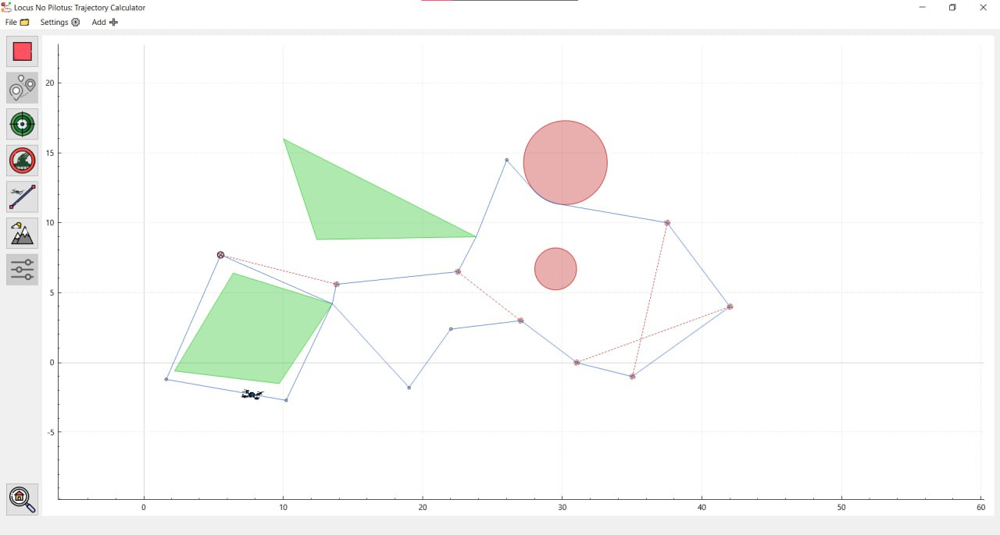

# Locus No Pilotus: Trajectory Calculator

<div align="center">
  
</div>

**Project of four first grade MIPT AES DAFE students (for engineering practical work in the second semester) in Qt C++**

<div align="center">
  
</div>

## Documentation

Project's [documentation](https://bpla-team.github.io/locus_no_pilotus) generated with Doxygen with [convenient CSS theme](#used-libs-and-sources).

# Contents

- [Description](#description)
- [Architecture](#architecture)
- [Installation and configuring](#installation-and-configuring "with using MSYS")
  - [On Windows 64 bit system](#on-windows-64-bit-system)
  - [On Linux system](#on-linux-system)
- [Running tests](#running-tests)
- [Used libs and sources](#used-libs-and-sources "we are using GitHub submodules feature 😎")
- [Authors](#authors "the best guys")

## Description

In this project, we are developing an application that calculates the trajectory of a flying delivery robot that collects valuable cargo from control points: **Targets**.
On its way, it may encounter high mountains that it cannot fly over: **Hills**; or elliptical territories that are impossible to visit due to climate conditions: **TrappyCircles**.
Also, through some control points, the robot is simply unable to move, as the cargo may not be ready for transportation at that time, these are **TrappyLines**.

The robot's trajectory is calculated using several mathematical algorithms: Little's Algorithm (solving the Traveling Salesman Problem (TSP) for multiple robots), Dijkstra's Algorithm (finding the shortest path between two points in a graph), Geometric Algorithms for Obstacle Handling (tangents to circles and polygons and intersection checking), Visibility Graph Construction, Composite Trajectory Planning Algorithm.

This is a comprehensive system that combines geometric computations with optimization algorithms to solve complex trajectory planning problems in the presence of obstacles. The algorithms work together to find collision-free paths that minimize total travel distance while visiting all required points.

The graphical interface for constructing the trajectory was created using [Qt](#used-libs-and-sources) and [QCustomPlot](#used-libs-and-sources).

In the application, you can add objects using window forms, interact with the trajectory calculation plot using the mouse cursor, create and open files in `.json` format with a specific style for this application. Editing objects can also be done with cursors or using a special dynamic input field with tables, opened in a separate window mode or embedded in the main one.

_We strongly recommend that you install our application using the instructions below and try it out!_

## Architecture

The project is organized into four layered namespaces:

```
main/           - Application entry point (QApplication + MainWindow)
data_tools/     - MVC glue: DataManager (central data store), PlotArea (plot orchestration), TablesConnection (bidirectional table↔data sync)
├── gui/        - Drawable objects (visual wrappers around lib:: domain classes, QCustomPlot rendering)
└── lib/        - Pure domain model: Point, Target, Hill, TrappyCircle, TrappyLine, Segment (no Qt GUI dependency)
math/           - Computational geometry (visibility graphs, Dijkstra) + Little's branch-and-bound TSP solver
tests/          - Boost.Test unit tests (100+ test cases covering lib/ and math/)
```

**Data flow:** JSON file ↔ DataManager ↔ gui:: objects ↔ QCustomPlot plot. The `math/` module receives `lib::` data, computes the trajectory, and returns `lib::Segment` results which are wrapped as `gui::Segment` for visualization.

## Installation and configuring

#### On Windows 64 bit system

1. Install **[MSYS2](https://www.msys2.org/)** to any convenient folder as compiler setup

   > _P.S. of course you can try install all the libs and packages used in repo manually, but our team got pain and tears trying to install Boost on MINGW in this way, so we recommend to install MSYS (besides, it is an excellent tool for compiling any other C++ and etc. projects)_

2. Open `MSYS2 MSYS` console, copy the command below and paste it with `Shift+Ins` or `RBM and 'Paste'` to download all the packages used in our project

```
pacman -S mingw-w64-x86_64-gcc
pacman -S mingw-w64-x86_64-gdb
pacman -S mingw-w64-x86_64-ninja
pacman -S mingw-w64-x86_64-cmake
pacman -U https://mirror.msys2.org/mingw/mingw64/mingw-w64-x86_64-qt-creator-13.0.1-1-any.pkg.tar.zst
pacman -S mingw-w64-x86_64-boost
pacman -S mingw-w64-x86_64-clang
```

3. Install **[Git Bash](https://gitforwindows.org/)** to any convenient folder (if you haven't get it yet)

4. Open `Git Bash` and use command like `cd C:/CodeFolder` to go to the folder where you usually save the code

5. Clone our repo with including submodules to such folder:

```
git clone --recurse-submodules https://github.com/BPLA-Team/locus_no_pilotus
```

6. Open the MSYS bin folder in path like `C:\YourPathToMsys\msys64\mingw64\bin` than find and start `qtcreator.exe`

7. In folder with our project clone find **_CMakeLists.txt_** and open it with QtCreator

8. Set the compiler that allow _CMake_ configuration in the kits list and click `Configure Project`

9. To use the full working version: **Build** (hammer button in the lower left corner) the project, and after ending process with error use **_Build > Run CMake_** in the top menu to reconfigure and fix error with including QCustomPlot

   > _P.S. because of using QCustomPlot, we need to copy additional .lib file to build directory, and our script does this when activating the Run CMake command_

10. Now you can use full working project with **Run** (green triangle button in the lower left corner)!

#### On Linux system

1. Install required packages. On **Ubuntu/Debian**:

```bash
sudo apt update
sudo apt install build-essential cmake ninja-build gdb clang
sudo apt install qt6-base-dev qt6-tools-dev libqt6printsupport6-dev
sudo apt install libboost-all-dev
```

On **Fedora**:

```bash
sudo dnf install gcc-c++ cmake ninja-build gdb clang
sudo dnf install qt6-qtbase-devel qt6-qttools-devel
sudo dnf install boost-devel
```

On **Arch Linux**:

```bash
sudo pacman -S base-devel cmake ninja gdb clang
sudo pacman -S qt6-base qt6-tools
sudo pacman -S boost
```

2. Clone the repository with submodules:

```bash
git clone --recurse-submodules https://github.com/BPLA-Team/locus_no_pilotus
cd locus_no_pilotus
```

3. Build the project with CMake:

```bash
cmake -B build -G Ninja -DCMAKE_BUILD_TYPE=Release
cmake --build build
```

4. Run the application:

```bash
./build/main/locus_no_pilotus
```

> _P.S. The project requires Qt6 - Qt5 fallback was removed as of commit `69d0a4b`._

> Much respect and help for this installation method to [George Sukhanov](https://github.com/TheFueRr "our colleague with an equally interesting project on processing experimental data")!

## Running tests

The project includes **100+ unit tests** using the [Boost.Test](https://www.boost.org/doc/libs/release/libs/test/) framework, covering both the core data library and all mathematical algorithms.

**Test coverage:**
| Module | What's tested |
|---|---|
| `lib/` | Point arithmetic (1000 random iterations), Segment construction (lines & arcs), Target & TrappyCircle getters/setters |
| `math/` | Tangents between obstacles (all types), intersection detection, distance functions (point, circle, polygon), Dijkstra's algorithm (6 hand-crafted graphs), Little's TSP solver (single & multi-salesman, random/symmetric/obstacle-wise matrices, 2×2 to 10×10), optimal way end-to-end (12 obstacle scenarios) |

**Running tests from command line** (after building):

```bash
# In the build directory:
ctest --test-dir build
# Or run the test executable directly:
./build/tests/tests
```

**Running tests in Qt Creator:** select the `tests` target in the run configuration dropdown and press **Run** (green triangle).

## Used libs and sources

- [CMake](https://cmake.org/): main project build system
- [Qt](https://www.qt.io/): main project library for full-working program
- [QCustomPlot](https://www.qcustomplot.com/): library for drawing all objects on same place with autoscaling ([submodule](https://github.com/UmbrellaLeaf5/qcustomplot "reference for submodule with lib in GitHub"))
- [Boost](https://www.boost.org/): Boost.Test for unit testing, Boost.Locale for string processing
- [Doxygen](https://www.doxygen.nl/): full documentation generation
- [Doxygen Awesome](https://github.com/jothepro/doxygen-awesome-css): convenient CSS theme for Doxygen HTML documentation (it is really awesome)
- [Flaticon](https://www.flaticon.com/): perfect icons source
- [GeoGebra](https://www.geogebra.org/): best platform for geometry calculations

## Authors

**[Romanov Fedor](https://github.com/Romanov-Fedor "math greatest gigachad and refactor guy (also Desmos and GeoGebra proger)")**

**[Rybalkin Ilya](https://github.com/Stargazer2005 "traveling salesman problem and Dijkstra algos enjoyer, the trajectory guy")**

**[Akramov Nikita](https://github.com/MrWh1teF0x "jsons, add forms, cursors, animation, scale hero")**

**[Krivoruchko Dmitry](https://github.com/UmbrellaLeaf5 "repo manager and gui guy with tables instead of muscles and arcs instead of veins")**
